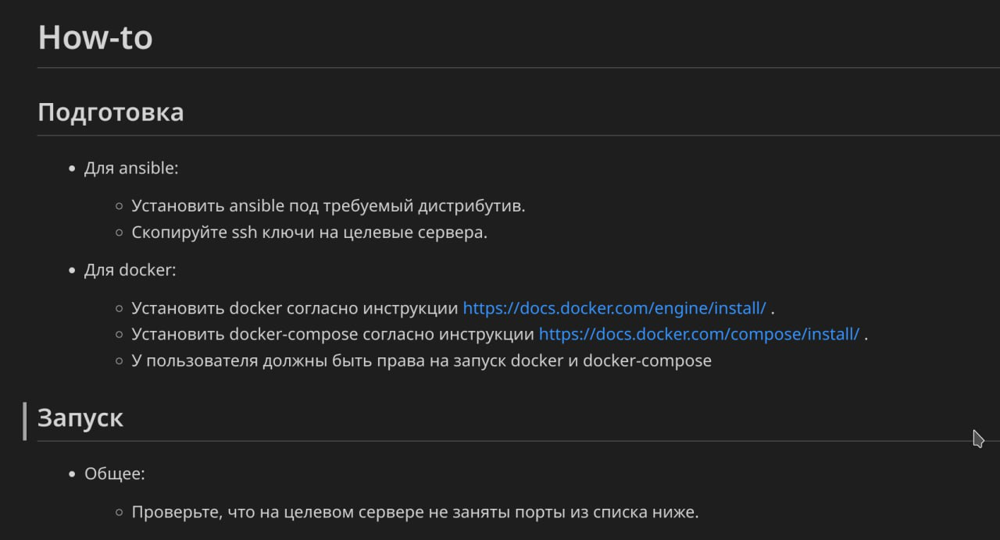

# Задача 2 - Ansible & Docker

### Задача



---

* [Ansible](#ansible)

## Ansible

На пока взял пример отсюда:

https://github.com/tutorialworks/ansible-playbook-simple

```bash
$ ansible-playbook -i hosts --extra-vars "person=Username" site.yml
```
```
PLAY [Play that prints a debug message] ***************************************************************************************************************************

TASK [Gathering Facts] ********************************************************************************************************************************************
ok: [localhost]

TASK [ansible.builtin.debug] **************************************************************************************************************************************
ok: [localhost] => {
    "changed": false,
    "msg": "Hello there Username!"
}

PLAY RECAP ********************************************************************************************************************************************************
localhost                  : ok=2    changed=0    unreachable=0    failed=0    skipped=0    rescued=0    ignored=0
```
* В конфе есть опечатка, сообщение прилетает как `Henlo`

---
[К предыдущей](./task1.md) | [Вначало](#задача-2---ansible--docker) | [К следующей]()