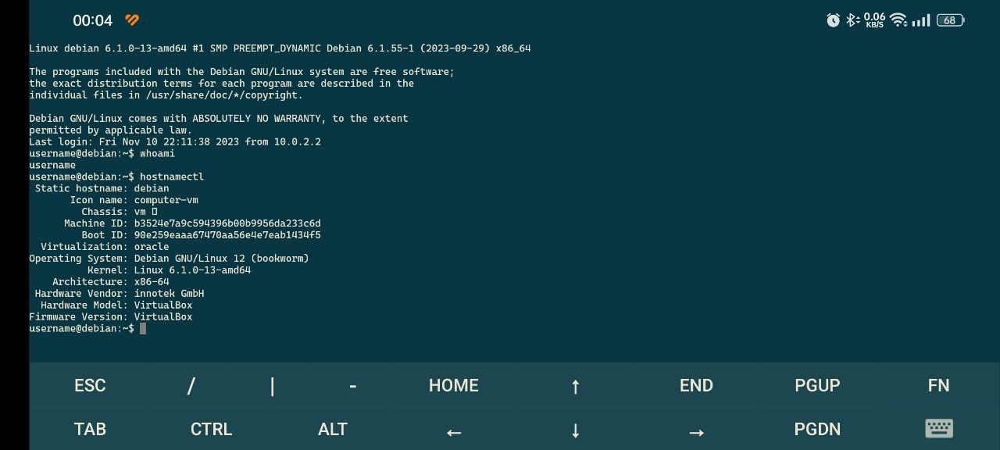

# Задача 2 - Linux

### Задача

На виртуальные машины поставить Debian 12 и Centos 7. На них установить основной apache (backend) и проксирующий nginx 
(frontend). В nginx\`е настроить балансировку на оба apache`а. Инструкцию написать в гит вторым уроком, сделать МР на 
меня.

В инструкции должны быть пункты:
1) Виртуальная машина - как настроить для Вашей ОС, задать ресурсы.
2) Дистрибутивы Linux - где брать, платно ли это, основные отличия двух перечисленных выше.
3) Когда задолбался писать команды вручную в окне ВМ - ssh и с чем его едят.
4) Как устанавливают ПО в Linux - make install, пакетные менеджеры.
5) Почему:
   
   а) в Debian поставились два веб-сервера, но заработал только один.
   
   б) в Centos поставились два веб-сервера, ни один не заработал.
   
   в) Как вы это узнали? Что им мешает? Как сделать, чтоб они запускались при старте системы?
   
   г) в Debian дефолтная страница веб сервера открывается, а в Centos нет.
   
   д) Про сети нужно что-то знать и понимать.
6) Скриншоты или видео, где показана работа системы.

Для выполнения задания вам должно хватить (на каждую ВМ) 5 Гб места, 0,5 Гб ОЗУ, 1 vCPU. При установке ВМ сделать 
снимок. перед сдачей МР откатить ВМ на первоначальное состояние и по своей инструкции повторить настройку заново.

Приветствуется краткость и лаконичность. Копировать весь man не надо. В описание задания есть мины и неточности.

---

1. [Виртуальная машина](#virtual-machine)
   1. [Установка](#установка)
   2. [Настройка](#настройка)
2. [Дистрибутивы Linux](#дистрибутивы)
   1. [Где взять](#образы)
   2. [Отличия](#отличия)
3. [SSH](#ssh)
   1. [Настройка ВМ](#настройка-вм)
   2. [Настройка ОС](#настройка-ос)
   3. [SSH ключи](#ssh-ключи-для-быстрого-доступа)
4. [Установка ПО](#установка-по)
   1. [Установка из сорцов](#установка-из-исходников)
   2. [Установка из пакетов](#менеджеры-пакетов)
5. [Root](#root)
6. [systemd](#подсистема-инициализации-и-управления-службами-systemd)
   1. [Команды](#основные-команды-для-взаимодействия)
#

## Virtual Machine

### Установка

В плане VM решил взять VirtualBox. Бесплатный, простой, понятный.

Так-как у меня Ubuntu устанавливал из пакета.
```shell
sudo apt install virtualbox
```

### Настройка

Настройка кнопками и ползунками.

В момент создания ВМ'ки указываем тип операционной системы как Linux и версию в соответствии с веткой задания, либо 
Debian, либо RedHat, так как CentOS операционная система именно этого семейства.

Далее указываем количество оперативной памяти и дискового пространства. Виртуальная машина создана. Далее в настройках 
можем указать количество процессоров, является ли диск твердотельным и примонтировать образ, который будет загружен.

## Дистрибутивы

### Образы

Образы дистрибутивов взяты с официальных сайтов. Они бесплатны, так-как не Enterprise. Да и на ентерпрайсе вроде платят
не за систему, а за поддержку.

***Debian:*** https://www.debian.org/distrib/netinst/debian-12.2.0-amd64-netinst.iso

***CentOS:*** http://mirrors.datahouse.ru/centos/7.9.2009/isos/x86_64/CentOS-7-x86_64-Minimal-2009.iso

> Ссылка на `CentOS` взята с http://isoredirect.centos.org/centos/7/isos/x86_64/, однако здесь предоставляется список 
> зеркал. Какой из них брать? ХЗ! В теории лучше тот который территориально ближе, но какой из них ближе Я без понятия, 
> по этому был взят первый по списку!

### Отличия
1) Концептуальных отличий не знаю, кроме того что 2 разных семейства. Debian это Debian, а CentOS это RedHat.
2) Есть разница в устанавливаемых пакетах. Пакеты Debian имеют расширение `.deb`, а CentOS `.rpm`.
3) Отличаются менеджеры пакетов. Debian используют программу `apt`, CentOS `yum`.

В целом прям такие яркие отличия на этом и заканчиваются, кроме того что с 21го года RedHat прекратила поддержку CentOS,
а сам проект вообще закрыт.

## SSH
SSH (Secure Shell) - Сетевой протокол позволяющий управлять операционной системой на подобии какого-нибудь Telnet, 
только при это ещё и шифрует трафик.

### Настройка ВМ
Перед настройкой SSH у ОС, необходимо пробросить порты виртуальной машины у VirtualBox. 

Настройки -> Сеть -> Дополнительно -> Проброс портов

Имя любое, протокол выбираем как TCP, адрес хоста указывать не обязательно, адрес гостя тоже, всё равно коннект будет 
по хостовой тачке. Порт хоста, это порт по которому мы будем подключаться к удалённой тачке, а порт гостя это 
стандартный ssh порт.

| Имя    | Протокол | Адрес хоста | Порт хоста | Адрес гостя | Порт гостя |
|--------|----------|-------------|------------|-------------|------------|
| Debian | TCP      | -           | 2222       | -           | 22         |
| CentOS | TCP      | -           | 2220       | -           | 22         |

Такую настройку нужно сделать у каждой машины по отдельности.

### Настройка ОС
При установке Debian будет предложено предустановить ssh-сервер, однако можно поставить и самому.
```shell
sudo apt install openssh-server
```
Проверяем статус, что служба запущена и работает.
```shell
sudo systemctl status ssh
```
```shell
● ssh.service - OpenBSD Secure Shell server
     Loaded: loaded (/lib/systemd/system/ssh.service; enabled; preset: enabled)
     Active: active (running) since Fri 2023-11-10 21:26:34 +10; 1h 31min ago
       Docs: man:sshd(8)
             man:sshd_config(5)
    Process: 565 ExecStartPre=/usr/sbin/sshd -t (code=exited, status=0/SUCCESS)
   Main PID: 582 (sshd)
      Tasks: 1 (limit: 4623)
     Memory: 7.2M
        CPU: 750ms
     CGroup: /system.slice/ssh.service
             └─582 "sshd: /usr/sbin/sshd -D [listener] 0 of 10-100 startups"
```
Стоит обратить внимание на пункт `Loaded`. Если стоит параметр `enabled`, значит сервис добавлен в автозагрузку, если 
нет, это можно также сделать с помощью систему управления службами.
```shell
sudo systemctl enabled ssh
```
Для CentOS всё аналогично, только демон там зовётся как `sshd.service`.
```shell
sudo systemctl status sshd
```

Теперь можно попробовать подключится. Вызываем ssh с флагом `-p` который отвечает за порт, указываем порт нужной машины
указанный в настройках. После имя пользователя удалённой тачки и адрес хоста на котором крутятся ВМ. 
`ssh -p $PORT $USER@$HOST`
```shell
# Debian
ssh -p 2222 username@localhost
# CentOS
ssh -p 2220 username@localhost
```

Если подключаемся с других устройств, то вместо `localhost` разумеется указываем ip адрес.


### SSH ключи для быстрого доступа
SSH-ключи необходимы для идентификации пользователя по протоколу SSH, вместо авторизации по паролю.

Для генерации ключа на клиенте используем команду `ssh-keygen`. После ряда вопросов типа куда сохранить, проверочная 
фраза и т.д. будет создан отпечаток ключа `key fingerprint`. По умолчанию он сохраняется в `~/.ssh/`. В `.ssh` будет 
создано 2 файла, `id_rsa.pub` являющийся публичным ключом, который будем использовать, а так же `id_rsa`. 
`~/.ssh/id_rsa` - это закрытый ключ который никому не стоит показывать.

Также при создании ключа можно указать время его жизни, так же число бит ключа и метод шифрования.

После того как ключ был создан, его открытую часть необходимо скопировать на удалённую машину где собираемся 
авторизовыватся.
#### Debian
```shell
cat ~/.ssh/id_rsa.pub | ssh username@localhost 'mkdir -p ~/.ssh && cat >> ~/.ssh/authorized_keys'
```
#### CentOS
В целом для CentOS команда аналогичная, за исключением, того что рекурсивно для директории `.ssh` применяется chmod. 
В противном случае ключ не будет использоваться и попытки авторизации будут приводить к тому что будет запрашиваться 
пароль.
```shell
cat ~/.ssh/id_rsa.pub | ssh username@localhost "mkdir -p ~/.ssh && touch ~/.ssh/authorized_keys && chmod -R go= ~/.ssh && cat >> ~/.ssh/authorized_keys"
```

## Установка ПО
В Linux основных 2 варианта установки программного обеспечения. 
1. Из сорцов `./configure && make && make install`.
2. Из пакетов с помощью `dpkg`, `apt-get` или `apt` для Debian систем и `yum` для RH. 
> Возможно для RH есть ещё что-то как в случае Debian, но тут Я без понятия. 

### Установка из исходников
В целом тут всё просто. 

`./configure` - по сути осуществляет подготовку исходников перед компиляцией. Ищет заголовки, подключает библиотеки и 
так далее, после чего создаётся необходимый для сборки файл с именем `Makefile`.

`make` - непосредственно сам процесс компиляции. Читает `Makefile` где описан процесс сборки программы.

`make install` - собственно процесс установки собранной программы. Так-как исполняемые файлы за частую ставятся в 
директории `/usr/../` то могут потребоваться привелегии суперпользователя ну или сокращённо `root`.

### Менеджеры пакетов
Использование менеджеров пакетов всегда исполняется с root правами.

То есть или
```
$ su - авторизуемся как root
# apt install {packegname} - для Debian
# yum install {packegname} - для RH
```
или
```shell
$ sudo apt install {packegname} - для Debian
$ sudo yum install {packegname} - для RH 
```
где `sudo`(substitute user and do - подменить пользователя и выполнить), это утилита для повышения привелегий до уровня 
суперпользователя.

## Root
Может быть так что пользователь не включён в группу `sudo` из-за чего при попытке выполнить команду может приводить к 
сообщению `$USER is not in the sudoers file`. В Debian по умолчанию так.

Чтобы добавить в пользователя Debian в группу sudo нужно воспользоваться командой `usermod`. Однако так-как в переменной
`$PATH` отсутствует ссылка на `/usr/sbin`, то выполнение команды приведёт к сообщению о том что команда не найден. По 
этому для решения данной проблемы используем полный путь до утилиты. Можно конечно и добавить путь в переменную, однако 
зачем? Всё равно команда используется только один раз. 
> ВАЖНО: Выполнять команду необходимо из под root, по этому сперва меняем пользователя на root и затем выполняем команду
```
$ su
# /usr/sbin/usermod -aG sudo $USER
```

## Подсистема инициализации и управления службами systemd
По сути `systemd` это менеджер управления модулями, которые из себя представляют специально оформленные файлы 
конфигурации. Каждый модуль отвечает за точки монтирования `.target`, файл подкачки `.swap`, подключаемые устройства 
`.device`. Чаще всего приходится взаимодействовать с модулем отвечающим за работу сервисов (служб или демонов) 
`.service`.

Демон - в `UNIX` подобных системах программа работающая в фоне.

Для взаимодействия с systemd используется утилита `systemctl`, для которой можно указать интересующую нас команду и 
далее имя интересующего нас модуля, либо целиком включая тип модуля, либо только имя. 

```shell
systemctl status ssh.service == systemctl status ssh
```

### Основные команды для взаимодействия
* status - посмотреть статус выполнения службы
* start - запустить службу
* stop - остановить
* restart - перезапуск stop && start службы
* reload - перечитать конфигурацию не останавливая работу службы
* enable - добавить службу в автозапуск
* disable - удалить службу из автозапуска

## Apache

---
[К предыдущей](../task1/task1.md) | [Вначало](#задача-2---linux) | [К следующей]()