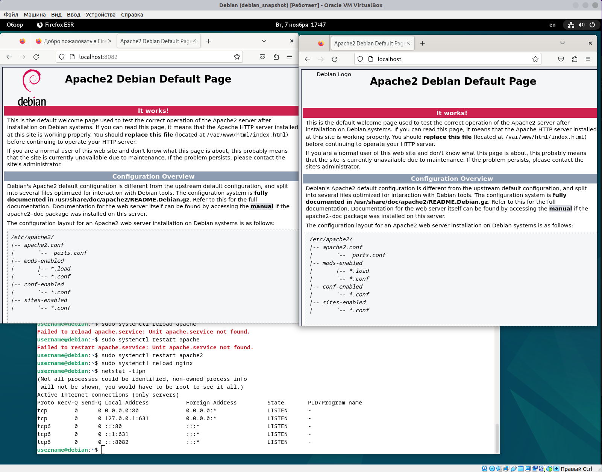
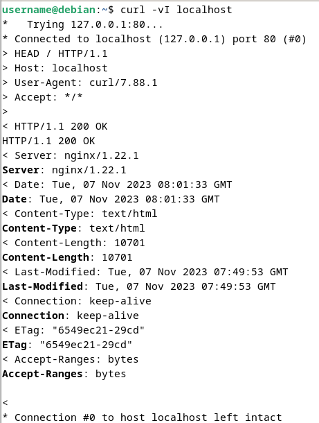

# Задача 2 - Linux

### Задача

На виртуальные машины поставить Debian 12 и Centos 7. На них установить основной apache (backend) и проксирующий nginx 
(frontend). В nginx\`е настроить балансировку на оба apache`а. Инструкцию написать в гит вторым уроком, сделать МР на 
меня.

В инструкции должны быть пункты:
1) Виртуальная машина - как настроить для Вашей ОС, задать ресурсы.
2) Дистрибутивы Linux - где брать, платно ли это, основные отличия двух перечисленных выше.
3) Когда задолбался писать команды вручную в окне ВМ - ssh и с чем его едят.
4) Как устанавливают ПО в Linux - make install, пакетные менеджеры.
5) Почему:
   а) в Debian поставились два веб сервера, но заработал только один.
   б) в Centos поставились два веб сервера, ни один не заработал.
   в) Как вы это узнали? Что им мешает? Как сделать, чтоб они запускались при старте системы?
   г) в Debian дефолтная страница веб сервера открывается, а в Centos нет.
   д) Про сети нужно что-то знать и понимать.
6) Скриншоты или видео, где показана работа системы.

Для выполнения задания вам должно хватить (на каждую ВМ) 5 Гб места, 0,5 Гб ОЗУ, 1 vCPU. При установке ВМ сделать 
снимок. перед сдачей МР откатить ВМ на первоначальное состояние и по своей инструкции повторить настройку заново.

Приветствуется краткость и лаконичность. Копировать весь man не надо. В описание задания есть мины и неточности.

---

## Virtual Machine

### Установка

В плане VM решил взять Virtual Box. Беспланый, легко ставится.

```shell
sudo apt install virtualbox
```

## Образы
***Debian:*** https://www.debian.org/distrib/netinst

## Настройка сервера

В общедоступных каталогах разместил shell для автоматической настройки

### Debian
```shell
sudo /media/sf_share/debian.sh
```
```shell
#!/bin/bash
sudo apt update && sudo apt upgrage
sudo apt install net-tools curl gedit apache2 nginx
echo 'Configure Apache'
# Добавляем апач в автозагрузку
sudo systemctl enable apache2
# Создаём бэкап, дабы не пролюбить оригинальный конфиг
sudo cp /etc/apache2/ports.conf /etc/apache2/ports_bkp.conf
# Меняем порт листнера апача
sudo sed -i 's/Listen 80/Listen 8082/' /etc/apache2/ports.conf
sudo systemctl restart apache2
echo 'Apache is ok'
echo 'Configure Nginx'
# Cоздаём конфиг nginx, какой порт слушать и куда сливать трафик
sudo cat << EOF > /etc/nginx/sites-available/apache
server {
    listen 80;
    location / {
        proxy_pass http://localhost:8082;
        proxy_set_header X-Real-IP \$remote_addr;
        proxy_set_header X-Forwarded-For \$proxy_add_x_forwarded_for;
        proxy_set_header Host \$http_host;
        proxy_set_header X-Forwarded-Proto \$scheme;
    }
}
EOF
# Делаем символьную ссылку на конф дабы он стал доступен 
sudo ln -s /etc/nginx/sites-available/apache /etc/nginx/sites-enabled/apache
sudo systemctl reload nginx
echo 'Nginx is ok'
```

## Результат

### Debian


Видим что для apache был поднят listener на порту `8082`, а nginx слушает `80`.



---
[К предыдущей](../task1/task1.md) | [Вначало](#задача-2---linux) | [К следующей]()