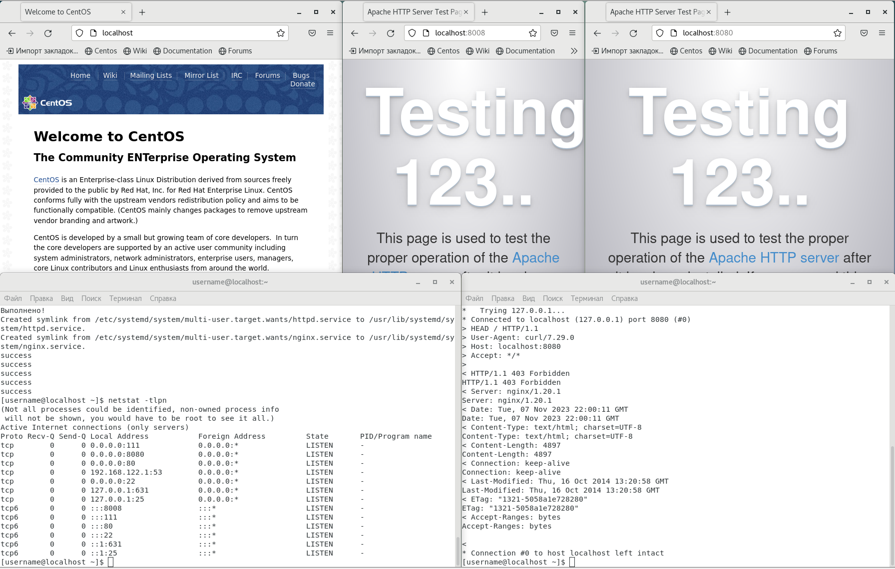

# Задача 2 - Linux

### Задача

На виртуальные машины поставить Debian 12 и Centos 7. На них установить основной apache (backend) и проксирующий nginx 
(frontend). В nginx\`е настроить балансировку на оба apache`а. Инструкцию написать в гит вторым уроком, сделать МР на 
меня.

В инструкции должны быть пункты:
1) Виртуальная машина - как настроить для Вашей ОС, задать ресурсы.
2) Дистрибутивы Linux - где брать, платно ли это, основные отличия двух перечисленных выше.
3) Когда задолбался писать команды вручную в окне ВМ - ssh и с чем его едят.
4) Как устанавливают ПО в Linux - make install, пакетные менеджеры.
5) Почему:
   а) в Debian поставились два веб сервера, но заработал только один.
   б) в Centos поставились два веб сервера, ни один не заработал.
   в) Как вы это узнали? Что им мешает? Как сделать, чтоб они запускались при старте системы?
   г) в Debian дефолтная страница веб сервера открывается, а в Centos нет.
   д) Про сети нужно что-то знать и понимать.
6) Скриншоты или видео, где показана работа системы.

Для выполнения задания вам должно хватить (на каждую ВМ) 5 Гб места, 0,5 Гб ОЗУ, 1 vCPU. При установке ВМ сделать 
снимок. перед сдачей МР откатить ВМ на первоначальное состояние и по своей инструкции повторить настройку заново.

Приветствуется краткость и лаконичность. Копировать весь man не надо. В описание задания есть мины и неточности.

---

## Virtual Machine

### Установка

В плане VM решил взять VirtualBox. Бесплатный, простой, понятный.

## Образы
***Debian:*** https://www.debian.org/distrib/netinst/debian-12.2.0-amd64-netinst.iso

***CentOS:*** http://mirrors.datahouse.ru/centos/7.9.2009/isos/x86_64/CentOS-7-x86_64-Minimal-2009.iso

## Настройка OS на виртуалке

### Debian 
Ничего особенного кроме установки гостевых дополнений для VirtualBox. Но там ничего необычного. Смонтировал образ, 
выполнил программу инсталяции.

### CentOS

#### Установка графической оболочки ***опционально***

<details>
   <summary>Как делать</summary>
   <p>
      Взято из этой <a href="https://serverspace.ru/support/help/installing-the-gnome-gui-on-centos-7/">статьи</a>
   
Сперва обновляемся
```shell
yum update
```
Забавный факт. В отличие от debian дистрибутивов, cent не требует `upgrade`. Либо Я этот момент успешно забыл в `RedHat`
дистрибутивах, что не удивительно ибо более 10 лет прошло с момента использования `OpenSUSE`, то ли это какой-то прикол 
именно `CentOS`. ¯\_(ツ)_/¯

Устанавливаем библиотеки связанные с `GNOME`
```shell
sudo yum -y groups install "GNOME Desktop"
```

Указываем что GNOME графическая среда по умолчанию
```shell
echo "exec gnome-session" >> ~/.xinitrc
```

Запускаем нашего икса
```shell
startx
```

Добавляем икса в автозапуск
```shell
systemctl set-default graphical.target
```
   </p>
</details>

#### Установка гостевых дополнений для VirtualBox

В отличие от `Debian`, здесь нужно сперва установить набор GNU компиляторов, дабы сбилдить модули ядра.
```shell
yum install -y gcc make perl kernel-devel
```
В противном случае установка может не выполнится, что у меня приводило к отказу в монтировании общедоступной директории 
с VirtualBox. За пример брал эту [статью](https://www.pc4xp.ru/art/detail.php?ID=55).

## Настройка сервера

Пошел в сторону написания shell скрипта для ускорения настройки.

Получаем имя операционной системы для дальнейшего выбора варианта установки и настройки
```shell
os_name=`hostnamectl | grep "Operating System:" | awk '{print $3}'`
```

Выбор типа установки 
> Возможно для CentOS нужно получать не только имя, но ещё и версию =\ Но это пока не так важно.
```shell
if [[ $os_name = 'Debian' ]]
then 
	configureDebian
elif [[ $os_name = 'CentOS' ]]
then
	configureCentOS
else
	echo "ERROR: Не задано поведение для вашей системы! $os_name"
fi
```

Функция установки и настройки
```shell
# Debian
function configureDebian {}
#CentOS
function configureCentOS {}
```

Установка необходимого софта
> CentOS требует наличия подключенной репы epel-release для установки nginx, a apache это httpd
```shell
# Debian
sudo apt install net-tools curl gedit apache2 nginx
# CentOS
sudo yum install epel-release
sudo yum -y install net-tools curl gedit httpd nginx
```

Добавляем службы в автозагрузку
> Примечательно что на Debian добавлять nginx в автозапуск вроде не потребовалось, он и так работал после ребута машины.
> Но если нужно то ровно так же как и в CentOS.
```shell
# Debian
sudo systemctl enable apache2
# CentOS
sudo systemctl enable httpd && sudo systemctl enable nginx
```

Бэкапим конфиги для апача перед переопределением портов
```shell
# Debian
sudo cp /etc/apache2/ports.conf /etc/apache2/ports_bkp.conf
# CentOS
sudo cp /etc/httpd/conf/httpd.conf /etc/httpd/conf/httpd_bkp.conf
```

Переопределяем порт для апача
> Почему на CentOS не 82, а 08. Какая-то фигня с определением дефолтных портов. На стэке нашел лишь затронутую в скользь
> тему, так что в чём суть не понял. Танцы с бубном для открытия 82го не помогли, по этому оставил 08.
```shell
# Debian
sudo sed -i 's/Listen 80/Listen 8082/' /etc/apache2/ports.conf
# CentOS
sudo sed -i 's/Listen 80/Listen 8008/' /etc/httpd/conf/httpd.conf
```

Открываем порты в брандмауэре
> Актуально только для CentOS
```shell
sudo firewall-cmd --permanent --add-service=http
sudo firewall-cmd --permanent --add-service=https
sudo firewall-cmd --permanent --add-port=8008/tcp
sudo firewall-cmd --permanent --add-port=8080/tcp
sudo firewall-cmd --reload
```

Рестартим службу апача
```shell
# Debian 
sudo systemctl restart apache2
# CentOS
sudo systemctl restart httpd
```

Бэкапим конфиг nginx и меняем его для подключения директорий `sites-available` и `sites-enabled` 
> Актуально только для CentOS
>> nginx.conf на который замещаем содержит в себе строку `include /etc/nginx/sites-enabled/*` внутри блока `http {}`
```shell
sudo mv /etc/nginx/nginx.conf /etc/nginx/nginx_bkp.conf
sudo cp /media/sf_share/nginx.conf /etc/nginx/nginx.conf
sudo mkdir /etc/nginx/sites-available/ /etc/nginx/sites-enabled/
```

Создаём конфиг для проксирования
> В целом конфиг для обоих ни чем не отличается кроме отсутствия у CentOS директивы `proxy_set_header Host`. При его 
> наличии respond от сервера прилетает как `400 Bad Request`. Объяснения не нашел, так что сказать не могу.
```shell
# Debian
cat << EOF > /etc/nginx/sites-available/apache
    server {
        listen 80;
        location / {
            proxy_pass http://localhost:8082;
            proxy_set_header X-Real-IP \$remote_addr;
            proxy_set_header X-Forwarded-For \$proxy_add_x_forwarded_for;
            proxy_set_header Host \$http_host;
            proxy_set_header X-Forwarded-Proto \$scheme;
    	}
    }
EOF
# CentOS
cat << EOF > /etc/nginx/sites-available/apache
    server {
        listen 8080;
        location / {
            proxy_pass http://localhost:8008;
            proxy_set_header X-Real-IP \$remote_addr;
            proxy_set_header X-Forwarded-For \$proxy_add_x_forwarded_for;
            proxy_set_header X-Forwarded-Proto \$scheme;
    	}
    }
EOF
```

Создаём символьную ссылку на конфиг
```shell
sudo ln -s /etc/nginx/sites-available/apache /etc/nginx/sites-enabled/apache
```

Рестартим nginx
```shell
sudo systemctl restart nginx
```

### Сорцы скрипта

<details><summary>install.sh</summary>

```shell
#!/bin/bash
# Получаем имя операционной системы
os_name=`hostnamectl | grep "Operating System:" | awk '{print $3}'`

# Функция конфигурирования apache и nginx
function configureDebian {
	sudo apt update && sudo apt upgrage
	sudo apt install net-tools curl gedit apache2 nginx
	echo 'Configure Apache'
	sudo systemctl enable apache2
	sudo cp /etc/apache2/ports.conf /etc/apache2/ports_bkp.conf
	sudo sed -i 's/Listen 80/Listen 8082/' /etc/apache2/ports.conf
	sudo systemctl restart apache2
	echo 'Apache is ok'
	echo 'Configure Nginx'
cat << EOF > /etc/nginx/sites-available/apache
    server {
        listen 80;
        location / {
            proxy_pass http://localhost:8082;
            proxy_set_header X-Real-IP \$remote_addr;
            proxy_set_header X-Forwarded-For \$proxy_add_x_forwarded_for;
            proxy_set_header Host \$http_host;
            proxy_set_header X-Forwarded-Proto \$scheme;
    	}
    }
EOF
	sudo ln -s /etc/nginx/sites-available/apache /etc/nginx/sites-enabled/apache
	sudo systemctl reload nginx
	echo 'Nginx is ok'
}

function configureCentOS {
	sudo yum update
	sudo yum install epel-release
	sudo yum -y install net-tools curl gedit httpd nginx
	sudo systemctl enable httpd && sudo systemctl enable nginx
	sudo cp /etc/httpd/conf/httpd.conf /etc/httpd/conf/httpd_bkp.conf
	sudo sed -i 's/Listen 80/Listen 8008/' /etc/httpd/conf/httpd.conf
	sudo firewall-cmd --permanent --add-service=http
	sudo firewall-cmd --permanent --add-service=https
	sudo firewall-cmd --permanent --add-port=8008/tcp
	sudo firewall-cmd --permanent --add-port=8080/tcp
	sudo firewall-cmd --reload
	sudo systemctl restart httpd
	sudo mv /etc/nginx/nginx.conf /etc/nginx/nginx_bkp.conf
	sudo cp /media/sf_share/nginx.conf /etc/nginx/nginx.conf
	sudo mkdir /etc/nginx/sites-available/ /etc/nginx/sites-enabled/
cat << EOF > /etc/nginx/sites-available/apache
    server {
        listen 8080;
        location / {
            proxy_pass http://localhost:8008;
            proxy_set_header X-Real-IP \$remote_addr;
            proxy_set_header X-Forwarded-For \$proxy_add_x_forwarded_for;
            proxy_set_header X-Forwarded-Proto \$scheme;
    	}
    }
EOF
	sudo ln -s /etc/nginx/sites-available/apache /etc/nginx/sites-enabled/apache
	sudo systemctl restart nginx
}

# Условие проверки ОС, обновление и конфигурирование серверов
if [[ $os_name = 'Debian' ]]
then 
	configureDebian
elif [[ $os_name = 'CentOS' ]]
then
	configureCentOS
else
	echo "ERROR: Не задано поведение для вашей системы! $os_name"
fi
```

</details>

## Результат

<details><summary><b>Debian</b></summary>


Видим, что для apache был поднят listener на порту `8082`, а nginx слушает `80`.


</details>

<details><summary><b>CentOS</b></summary>



Видно, что на `80` крутится стартовая страница CentOS которая поддерживается как раз nginx из `/var/www/`, на `8008`
собственно стартовая страница `Apache`, на которую нас проксирует nginx при обращении к `8080`.

Прикол с `curl`. Видно, что при обращении к порту в качестве статускода он получил `403 Forbidden`, что значит доступ 
запрещён, хотя страница валидная. Забавно то, что браузер такого ответа не получает.

</details>

---
[К предыдущей](../task1/task1.md) | [Вначало](#задача-2---linux) | [К следующей]()